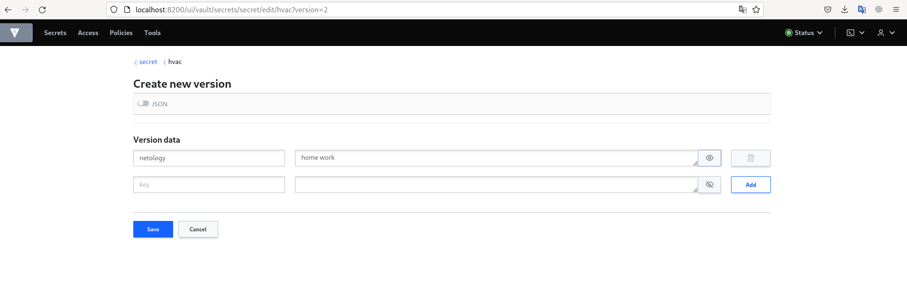

### Задача 1: Работа с модулем Vault

- Создание pods/vault
```
vlad@home:~/Documents/Netology/DevOps/netology-DevOps-dz_66$ kubectl get pods -o wide
NAME                  READY   STATUS    RESTARTS   AGE     IP               NODE      NOMINATED NODE   READINESS GATES
14.2-netology-vault   1/1     Running   0          16m     10.233.125.2     worker2   <none>           <none>
```

- создание второго модуля
```
vlad@home:~/Documents/Netology/DevOps/netology-DevOps-dz_66$ kubectl get pods -o wide
NAME                  READY   STATUS    RESTARTS   AGE     IP               NODE      NOMINATED NODE   READINESS GATES
14.2-netology-vault   1/1     Running   0          16m     10.233.125.2     worker2   <none>           <none>
fedora                1/1     Running   0          8m26s   10.233.105.130   worker1   <none>           <none>
```

- создание секрета и его чтение
```
>>> import hvac
>>> client = hvac.Client(
... url='http://10.233.125.2:8200',
... token='aiphohTaa0eeHei'
... )
>>> client.is_authenticated()
True
>>> client.secrets.kv.v2.create_or_update_secret(
...     path='hvac',
...     secret=dict(netology='Big secret!!!'),
... )
{'request_id': '1d6b0b74-7aa8-3d9a-d041-fc99085afa47', 'lease_id': '', 'renewable': False, 'lease_duration': 0, 'data': {'created_time': '2022-11-21T06:08:36.940930942Z', 'custom_metadata': None, 'deletion_time': '', 'destroyed': False, 'version': 1}, 'wrap_info': None, 'warnings': None, 'auth': None}
>>> client.secrets.kv.v2.read_secret_version(
...     path='hvac',
... )
{'request_id': 'f32ce8de-6cf9-c41f-710a-dd1537371ea1', 'lease_id': '', 'renewable': False, 'lease_duration': 0, 'data': {'data': {'netology': 'Big secret!!!'}, 'metadata': {'created_time': '2022-11-21T06:08:36.940930942Z', 'custom_metadata': None, 'deletion_time': '', 'destroyed': False, 'version': 1}}, 'wrap_info': None, 'warnings': None, 'auth': None}
>>> client.secrets.kv.v2.read_secret_version(
...     path='hvac',
... )
```

- изменние секрета через web


```
{'request_id': '7a7e0017-c0ac-3a39-e7be-a12a1d50e4f4', 'lease_id': '', 'renewable': False, 'lease_duration': 0, 'data': {'data': {'netology': 'home work'}, 'metadata': {'created_time': '2022-11-21T06:12:06.971345071Z', 'custom_metadata': None, 'deletion_time': '', 'destroyed': False, 'version': 2}}, 'wrap_info': None, 'warnings': None, 'auth': None}
```